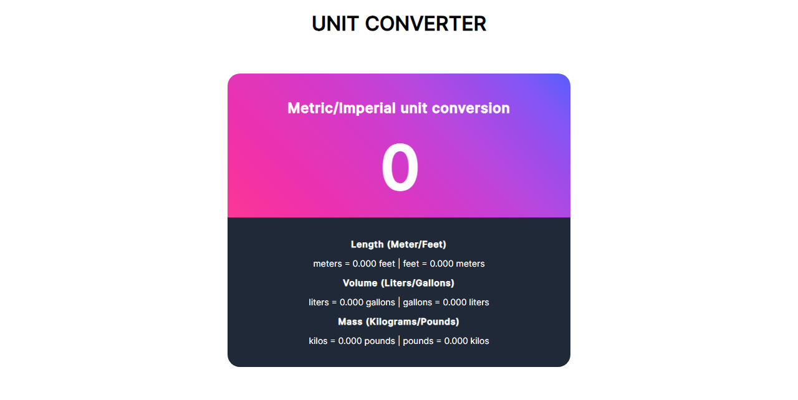

# unit-converter

This is my solution to the Unit Converter Solo Project challenge on Scrimba.

## Table of contents

- [Preview](#preview)
  - [The challenge](#the-challenge)
  - [Links](#links)
- [My process](#my-process)
  - [Built with](#built-with)
  - [Useful resources](#useful-resources)
- [Acknowledgments](#acknowledgments)

## Preview

</a>

### The challenge

Users should be able to:

- Insert a number in the input field for conversion between metric and imperial units
- See that number converted in three occasions such as mass,length and volume.

### Links

- Live Site URL: [https://vanesabordanaro.github.io/unit-converter/](https://vanesabordanaro.github.io/unit-converter/)

## My process
I started off with studying the figma prototype made for this project (https://www.figma.com/file/AdqUVRQCZGP1zRcEvzmJTm/Unit-Conversion?node-id=0%3A1) then the HTML
structure grouping elements with divs for flexbox to apply after for layout and styling with css. Finally I moved to javascript connecting the input value from the user for conversion.

### Built with

- Semantic HTML5 markup
- CSS
- Flexbox
- Javascript

### Useful resources

- [Scrimba](https://scrimba.com/) - Scrimba is an amazing platform for learning frontend web development. I am currently learning by their FrontEnd Developer Carrer Path
- [MDN](https://developer.mozilla.org/en-US/) - MDN is a great resource for frontend web development.

## Acknowledgments
Scrimba's discord channel code reviews is very helpfull for writing and checking your code.
